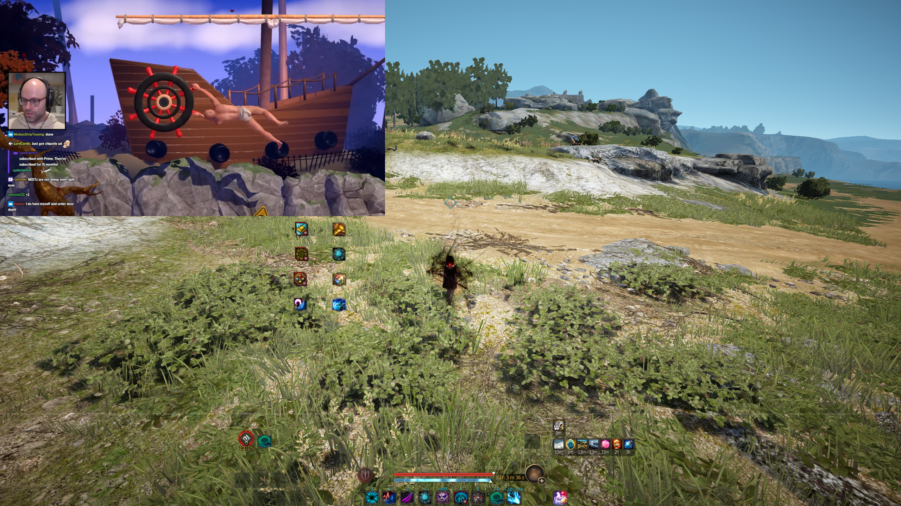

# waytop

A click-through video overlay for Wayland compositors. Shows a floating video window on the **overlay layer**, above fullscreen windows including games, and passes all mouse clicks straight through to the window underneath.

Think of it as an OnTopReplica alternative for Linux.



## Features

- **Click-through by default**: video plays on top of your game, clicks pass through
- **Lock/unlock toggle**: unlock to drag/resize, lock to make it click-through again
- **Drag to reposition**: click anywhere on the overlay and drag
- **Resize grip**: grab the bottom-right corner to resize
- **Scroll for volume**: scroll up/down on the overlay to adjust volume
- **Always on top**: uses the `overlay` layer of `wlr-layer-shell`, above fullscreen windows
- **No external dependencies**: the binary handles commands itself via `-c`
- **Powered by mpv**: plays any URL or file mpv supports (YouTube, Jellyfin, local files, streams)

## Requirements

- A Wayland compositor with `wlr-layer-shell` support (Niri, Sway, Hyprland, River, etc.)
- mpv (runtime dependency for libmpv)
- Development packages: `wayland-client`, `wayland-egl`, `EGL`, `GLESv2`, `libmpv`

### Arch Linux

```bash
sudo pacman -S wayland wayland-egl egl-wayland libglvnd mpv
```

## Build

```bash
git clone https://github.com/vevota/waytop.git
cd waytop
make
```

## Usage

```bash
# Play a video as a click-through overlay
./waytop "https://www.youtube.com/watch?v=..."

# With custom size
./waytop -s 640x360 "https://..."

# With margin from top-left
./waytop -m 32 "https://..."
```

### Control a running instance

```bash
./waytop -c toggle          # lock/unlock click-through mode
./waytop -c "pos 100 50"    # move to absolute position
./waytop -c "size 640x360"  # resize
./waytop -c "quit"          # exit
```

### overlay-ctl helper script

`overlay-ctl` is included for convenience, wrapping `waytop -c`:

```bash
./overlay-ctl               # click a point to position (via slurp)
./overlay-ctl toggle         # lock/unlock
./overlay-ctl pos 100 50    # move
./overlay-ctl size 640x360  # resize
./overlay-ctl quit
```

## How it works

| Layer | What renders |
|-------|-------------|
| Overlay | **waytop**: above everything |
| Top | Bars, panels, hidden by fullscreen |
| Floating/tiled | Normal windows |
| Fullscreen game | Focused game window |

The surface is created on the `overlay` layer of `wlr-layer-shell`, which is the only layer that renders above fullscreen windows. The input region is empty by default (locked): clicks pass through to whatever is underneath. When unlocked via `toggle`, the full surface receives pointer events for dragging and resizing.

Video rendering uses mpv's OpenGL render API with hardware decoding (auto-detected via `hwdec=auto`).

## Commands reference

| Command | Effect |
|---------|--------|
| `toggle` | Switch between locked (click-through) and unlocked (interactive) |
| `pos X Y` | Move overlay so its top-left corner is at (X, Y) on screen |
| `size WxH` | Resize to W×H pixels (min 100×56) |
| `quit` | Exit waytop |

## Interactive controls (unlocked mode)

| Action | Area |
|--------|------|
| Click + drag | Anywhere: moves the overlay |
| Bottom-right 40×40 grip | Click + drag to resize |
| Scroll wheel | Volume up/down (±5 per notch) |


